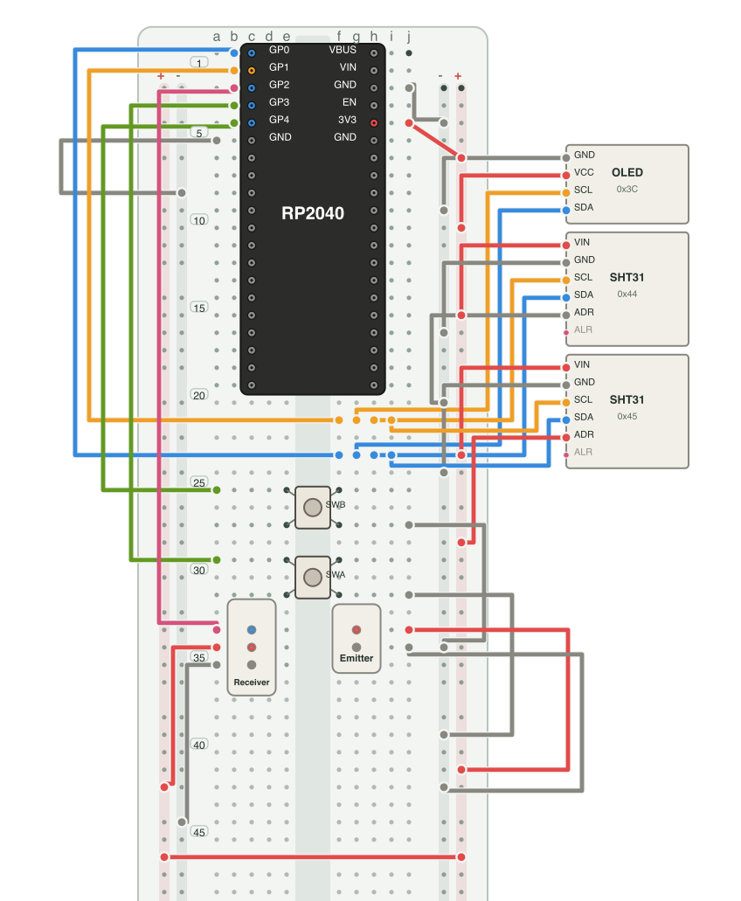

# breadkit-render

Project site: https://breadkit.github.io/breadkit-render/

`bkrender` turns a Breadkit DSL or resolved IR JSON file into a standalone SVG diagram. Breadkit DSL input is executable Ruby; only render files you trust. IR JSON is the data-only alternative.

Install `breadkit-render` directly; RubyGems installs its compatible `breadkit` core dependency. Shared circuit examples are in the [breadkit repository](https://github.com/breadkit/breadkit/tree/main/examples).

```sh
bkrender circuit.bk.rb -o circuit.svg --show-nets --legend
bkrender circuit.bk.rb -o circuit.png --scale 3 --theme light
bkrender circuit.bk.rb -o circuit.svg --orientation landscape
bkrender circuit.bk.rb -o circuit.svg --rail-pattern '+--+'
bkrender circuit.bk.rb --format svg > circuit.svg
```

## Example output

Generated from the shared [RP2040 sensor demo](https://github.com/breadkit/breadkit/blob/main/examples/05_sensor_demo.bk.rb). It uses the full-size 830-point board model. The image crops to the used area: the controller occupies rows 1–20, with switches and IR connections below and OLED/SHT31 modules beside it.

Rendered with `bkrender ../breadkit/examples/05_sensor_demo.bk.rb -o docs/images/sensor-demo.png --crop auto --rail-pattern '+--+' --scale 2`:



[Open the interactive SVG](docs/images/sensor-demo.svg). Its layer tabs isolate power, I2C, switches, IR, and the optional 5 V emitter wiring. The 5 V view is a dashed, visual-only alternative: remove the emitter's 3.3 V rail wire before applying it.

The shared example defines the board and IR connectors in the breadkit repository's [`examples/parts`](https://github.com/breadkit/breadkit/tree/main/examples/parts). Pin `type:` values such as `power`, `ground`, `clock`, `data`, `address`, and `interrupt` color the markers. `offboard` modules use a neutral surface color; connected pin names are emphasized, unused pins are muted, and `address:` text is shown on the module. Assign `layer:` to wires and components to create matching interactive views. `route: :edge` routes long wires outside the board and separates wires that would otherwise overlap.

Resistors use four color bands by default. Set `bands: 5` on a resistor for three significant digits and a 1% brown tolerance band.

## Options

| Option | Default | Description |
| --- | --- | --- |
| `-o, --output PATH` | stdout | Write to a file; `.svg`, `.png`, `.jpg`, and `.jpeg` select the format. |
| `-f, --format FORMAT` | inferred or `svg` | `svg`, `png`, or `jpeg`. Conflicting extensions are errors. |
| `--scale N` | `2` | Raster output scale. |
| `--theme NAME` | `light` | `light`, `dark`, or `print`. |
| `--orientation NAME` | `portrait` | `portrait` for a readable vertical board; `landscape` for a wide view. |
| `--rail-pattern PATTERN` | board layout | Assign `+`/`-` to the four rails in portrait order: left outer, left inner, right inner, right outer. Accepted patterns: `+--+`, `+-+-`, `-+-+`, `-++-`. Rail connections move with their assigned polarity. |
| `--color-by MODE` | `wire` | Use declared wire colors or deterministic net colors. |
| `--show-nets` | off | Add net labels to the diagram. |
| `--legend` | off | Add the title, connected net names, and representative wire colors. |
| `--crop MODE` | `auto` | `auto` crops to circuit content; `none` shows the full board. |
| `--annotations FILE` | none | Overlay offenses from `bklint --format json`. |
| `--backend NAME` | `auto` | Raster backend: `rsvg`, `vips`, or `magick`. |
| `--background COLOR` | white | JPEG background: basic CSS color name, `#RGB`, or `#RRGGBB`. PNG and SVG reject this option. |
| `--quality N` | `90` | JPEG quality. |
| `--static` | off | Omit SVG layer controls and embedded scripts. |
| `--force` | off | Draw resolved elements even when the input has layout errors. |

## Raster backends

SVG is rendered without extra dependencies. PNG uses the first available backend in the order `rsvg-convert`, `ruby-vips`, ImageMagick. JPEG uses `ruby-vips` or ImageMagick and is flattened onto the configured background. Install `librsvg` (`brew install librsvg` or `apt install librsvg2-bin`) or ImageMagick for raster output. `ruby-vips` also needs a libvips build with SVG support.

Connected breadboard holes and physically occupied holes use different markers. LED colors accept CSS color names and hexadecimal colors such as `#6d5af0`.

The SVG uses a system font stack including Noto Sans JP. Rasterized Japanese labels need a Japanese font installed in the environment.
