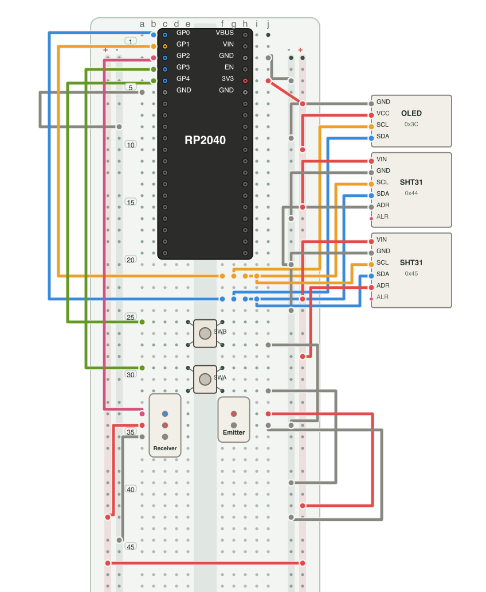
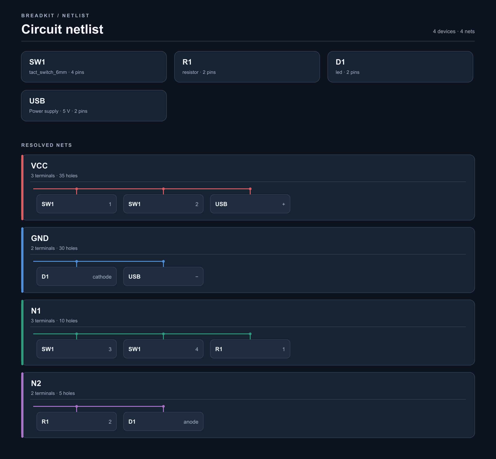
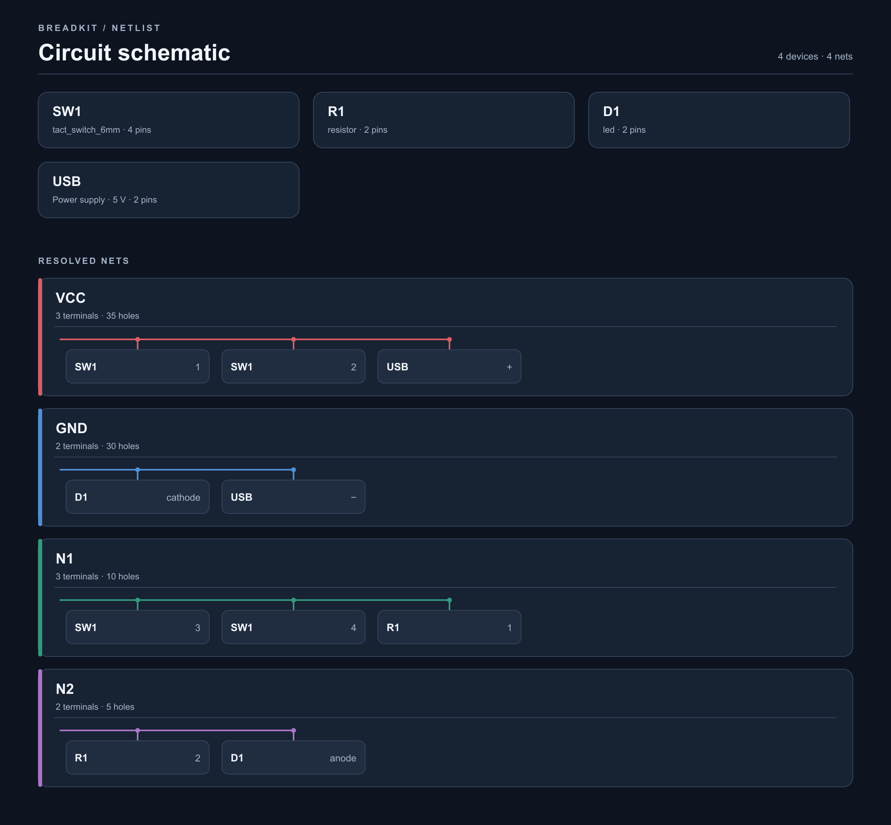

<p align="center">
  
</p>

<h1 align="center">breadkit-render</h1>

<p align="center">
  <strong>Turn breadboard circuits into clear, shareable diagrams.</strong>
</p>

<p align="center">
  <a href="https://rubygems.org/gems/breadkit-render"></a>
  <a href="https://github.com/breadkit/breadkit-render/actions/workflows/ci.yml"></a>
  
  <a href="LICENSE.txt"></a>
</p>

<p align="center">
  <a href="#example-output">Example</a> ·
  <a href="#quick-start">Quick start</a> ·
  <a href="#diagram-controls">Controls</a> ·
  <a href="#options">Options</a> ·
  <a href="https://breadkit.github.io/breadkit-render/">Website</a>
</p>

---

`bkrender` draws a [Breadkit](https://github.com/breadkit/breadkit) circuit
from a Ruby DSL file or resolved JSON IR. It produces SVG, PNG, and JPEG,
including diagrams with offboard modules and separately viewable wire layers.

## Example output

The [RP2040 sensor demo](https://github.com/breadkit/breadkit/blob/main/examples/05_sensor_demo.bk.rb)
uses a full-size breadboard, OLED, two SHT31 modules, switches, and IR receiver
and emitter connections.

<p align="center">
  
</p>

<p align="center">
  <a href="https://breadkit.github.io/breadkit-render/images/sensor-demo.svg">Open the interactive SVG</a>
</p>

The SVG's layer controls isolate power, I2C, switches, IR, and an optional 5 V
emitter connection. The 5 V layer is a visual alternative: remove the emitter's
3.3 V rail wire before using that connection. The receiver stays at 3.3 V.

## Quick start

The published 0.1.0 release works with Ruby 3.3 or newer:

```sh
gem install breadkit-render -v 0.1.0
bkrender circuit.bk.rb -o circuit.svg
```

This README documents the newer, unreleased `main` branch. It currently depends
on Breadkit core 0.2.0, which is also unreleased. To use these features now,
check out both repositories as siblings:

```sh
mkdir breadkit-dev && cd breadkit-dev
git clone https://github.com/breadkit/breadkit.git breadkit
git clone https://github.com/breadkit/breadkit-render.git breadkit-render
cd breadkit-render
bundle install
bundle exec ruby exe/bkrender ../breadkit/examples/01_led_button.bk.rb -o circuit.svg
```

The commands below use `bkrender` for readability. In a source checkout, run
`bundle exec ruby exe/bkrender` in its place. Choose a theme, add net labels,
or export a raster image:

```sh
bkrender circuit.bk.rb -o circuit.svg --theme dark --show-nets --legend
bkrender circuit.bk.rb -o circuit.png --scale 3
bkrender circuit.bk.rb -o circuit.webp --quality 85
bkrender circuit.bk.rb -o circuit.pdf
bkrender circuit.bk.rb --print-template -o board-template.pdf
bkrender circuit.bk.rb -o circuit.html --theme dark
bkrender circuit.bk.rb --view netlist --theme dark -o netlist.svg
bkrender circuit.bk.rb --view schematic --theme dark -o schematic.svg
bkrender circuit.bk.rb --label-density compact -o compact.svg
bkrender --diff before.bk.rb after.bk.rb -o changes.html
bkrender circuit.bk.rb --format svg > circuit.svg
```

PNG, JPEG, WebP, and PDF need a conversion backend; SVG works without one.
Breadboard labels show formatted values such as `330Ω` and `100nF` by default.
Use `--label-density compact` for references only, or `none` to hide foreground
component labels. `compact` is recommended for dense diagrams. Each SVG
includes a text netlist in `<desc>` and a `<title>`
for every board hole, including unused holes.

## Netlist view

`--view netlist` draws the resolved netlist as one bus per net. Every component
and supply terminal appears under the net it actually connects to. The layout
stays readable for large circuits by keeping each net in its own row; it does
not attempt conventional electronic symbols or show the physical wire route.
The netlist view also accepts named multi-board circuits and v2 JSON IR.

<p align="center">
  
</p>

Use `--state SW1` to render the switch's closed-state connectivity. Netlist
view supports SVG, PNG, JPEG, WebP, and PDF. HTML, diff, and breadboard-only
controls such as `--layer`, `--rail-pattern`, and `--focus` are unavailable.

## Schematic view

`--view schematic` draws each component once. Two-terminal parts use circuit
symbols whose wires join the resolved nets; crossing wires use a bridge where
they are not connected. ICs and modules use rectangular symbols with named
pins. A pin's colored net label connects it to the bus or any other pin with
the same label. Unconnected pins have muted, unlabeled stubs; their resolved
net identity remains in the SVG terminal data. Bus rows appear where a
two-terminal symbol attaches. This is an electrical view: board hole
positions and physical jumper routes do not appear.

For example, this powered LED path produces the diagram below:

```ruby
board :mini
supply :USB, voltage: 5, plus: "a1", minus: "a5"
net :VCC, at: "a1"
net :GND, at: "a5"
resistor :R1, "330", pins: %w[b1 b3]
led :D1, anode: "a3", cathode: "b5"
```

<p align="center">
  
</p>

The view also accepts named multi-board circuits and v2 JSON IR. It supports
SVG, PNG, JPEG, WebP, and PDF. HTML, assembly steps, diff, and breadboard-only
controls are unavailable.

## Assembly steps

Add numbered `step` blocks in the Breadkit DSL, then use `--step N` to show the
board after that step. Declarations outside step blocks appear in every image.

```ruby
board :half
step 1, title: "Place the resistor" do
  resistor :R1, "330", pins: %w[a12 a16]
end
step 2, title: "Add the LED" do
  led :D1, anode: "b16", cathode: "b17"
end
```

```sh
bkrender circuit.bk.rb --step 1 --theme dark -o step-1.svg
bkrender circuit.bk.rb --step 2 --theme dark -o step-2.svg
```

Each stage uses the full board dimensions and recalculates its nets from the
visible components and wires. The step title appears above the board. `--step`
works with breadboard SVG and image output; HTML, netlist view, diff,
print templates, and annotations are unavailable. A wire to a later board-mounted
component pin stays at that pin's physical hole until the component is placed.

## Named boards

Use a board name in each hole ID to place parts and wires across boards:

```ruby
board :mini, as: :B1
board :mini, as: :B2
supply :BAT, voltage: 5, plus: "B1.a1", minus: "B2.b5"
resistor :R1, "330", pins: %w[B1.a1 B1.a3]
led :D1, anode: "B2.a3", cathode: "B2.a5"
wire "B1.b3", "B2.b3", color: :red
```

`bkrender circuit.bk.rb --orientation landscape -o circuit.svg` draws separate
board plates and a jumper between their named holes. Portrait orientation
stacks the plates. Both orientations keep board and wire positions stable
across `--step` images. The breadboard and netlist views accept v2 JSON IR.
`--rail-pattern` is unavailable for named-board circuits.

## Diagram controls

- `--rail-pattern` assigns polarity to the four rails in portrait order:
  left outer, left inner, right inner, right outer. Choose `+--+`, `+-+-`,
  `-+-+`, or `-++-`; connected wires move with their rail.
- `--orientation landscape` gives a wide view. `--crop auto` keeps the
  diagram focused on used rows; `--crop none` shows the full board.
- Circuit `layer:` values group wires and components into interactive SVG
  views. `route: :edge` keeps long wires around the outside of the board.
- Offboard modules use their own pin definitions. Pin `type:` values such as
  `power`, `ground`, `clock`, and `data` mark each connection. Resistors use
  four color bands by default; `bands: 5` selects five.
- Footprint module bodies follow the DSL's `rotate:` and `mirror:` placement
  options, including asymmetric body offsets and labeled pins.
- The built-in `sc56_11ewa` seven-segment display and `wp154a4sureqbfzgc`
  RGB LED have dedicated diagram shapes.
- Occupied holes and connected holes have different markers. LED colors accept
  CSS names and hexadecimal values such as `#6d5af0`. Hover over an occupied
  or connected hole in the SVG to see its hole ID and net.
- `--state SW1` shows the selected switch as closed and uses that state's nets.
  `--layer "2 I2C"` keeps one named layer in static SVG, PNG, JPEG, WebP, or PDF output.
- `--focus R1` dims other components and unrelated wires.
  `--highlight-net VCC` emphasizes the selected net and its connected parts.
- HTML output provides a standalone viewer with zoom, pan, layer controls, and
  net highlighting on hover. Use the State menu or click a switch to see its
  open and closed wiring states.
- `--diff OLD NEW` creates a two-panel HTML viewer. Removed wires are red in
  the old view and added wires are green in the new view; matching wires use
  their normal colors.
- `--print-template` makes a PDF with 2.54 mm hole spacing, the complete board,
  and the print palette. Print at 100% scale; the option fixes the output scale
  to 1 and requires `rsvg-convert`.

The demo was generated with:

```sh
bkrender ../breadkit/examples/05_sensor_demo.bk.rb \
  -o docs/images/sensor-demo.png --crop auto --rail-pattern '+--+' --label-density compact --scale 2
```

## Options

| Option | Default | Description |
| --- | --- | --- |
| `-o, --output PATH` | stdout | Write to a file; `.svg`, `.html`, `.png`, `.jpg`, `.jpeg`, `.webp`, and `.pdf` select the format. |
| `-f, --format FORMAT` | inferred or `svg` | `svg`, `html`, `png`, `jpeg`, `webp`, or `pdf`. Conflicting extensions are errors. |
| `--view NAME` | `breadboard` | `breadboard`, `schematic` (symbols and net labels), or `netlist` (resolved net buses). |
| `--scale N` | `2` | Image and PDF output scale. |
| `--theme NAME` | `light` | `light`, `dark`, or `print`. |
| `--orientation NAME` | `portrait` | `portrait` or `landscape`. |
| `--rail-pattern PATTERN` | board layout | Set rail polarity with `+--+`, `+-+-`, `-+-+`, or `-++-`. |
| `--color-by MODE` | `wire` | Use declared wire colors or deterministic net colors. |
| `--label-density MODE` | `full` | Breadboard foreground labels: `full` (reference and value), `compact` (reference only), or `none` (hidden). |
| `--show-nets` / `--legend` | off | Add net labels or a circuit legend. |
| `--crop MODE` | `auto` | Crop to circuit content or show the full board with `none`. |
| `--annotations FILE` | none | Overlay offenses from `bklint --format json`. |
| `--state NAME` | open switches | Render a switch state such as `SW1`; net colors and switch markers follow that state. |
| `--step N` | all steps | Render the board after assembly step `N`, with a fixed full-board frame and a visible step title. |
| `--layer NAME` | all layers | Render one named layer, including in image and PDF output. |
| `--focus REF` | none | Emphasize one component and its connected wires. |
| `--highlight-net NAME` | none | Emphasize one net and its connected components. |
| `--diff` | off | Compare two circuit files in a standalone HTML viewer. |
| `--backend NAME` | `auto` | Use `rsvg`, `vips`, or `magick` for raster output. |
| `--background COLOR` | white | Set the JPEG background with a CSS name, `#RGB`, or `#RRGGBB`; PNG and SVG reject it. |
| `--quality N` | `90` | JPEG and WebP quality. |
| `--print-template` | off | Export a full-board PDF with physical hole spacing for 100% printing. |
| `--static` | off | Omit SVG layer controls and scripts. |
| `--force` | off | Draw resolved elements even when input has layout errors. |
| `--render-timeout SECONDS` | 60 | Limit external raster conversion time. |

## Raster backends

PNG uses the first available backend: `rsvg-convert`, `ruby-vips`, then
ImageMagick. JPEG and WebP use `ruby-vips` or ImageMagick. PDF uses
`rsvg-convert` and keeps the SVG as vector content. Install `librsvg`
(`brew install librsvg` or `apt install librsvg2-bin`) for PDF output.
`ruby-vips` needs a libvips build with SVG and WebP support for WebP output.

## Input safety

Breadkit DSL files execute Ruby code. Render only files you trust; use JSON IR
for data-only input.

## Development

The specs use examples from a sibling Breadkit checkout:

```sh
git clone https://github.com/breadkit/breadkit.git
git clone https://github.com/breadkit/breadkit-render.git
cd breadkit-render
bundle install
bundle exec rake
```

Bundler uses the sibling Breadkit checkout when it is present. Packaged
installations require Breadkit 0.2.x.

## License

breadkit-render is available under the [MIT License](LICENSE.txt).
